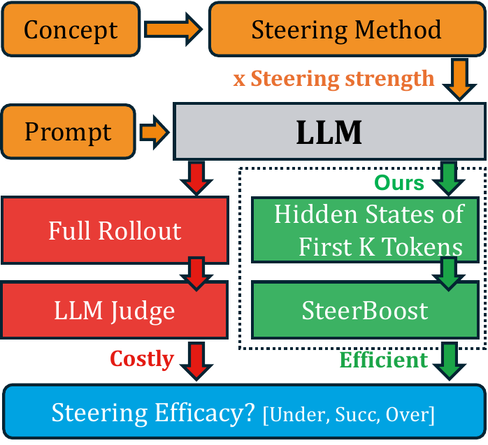
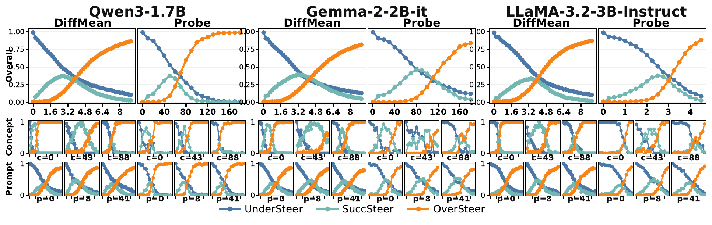
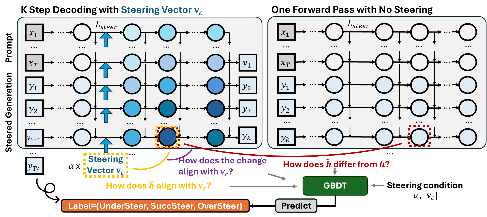
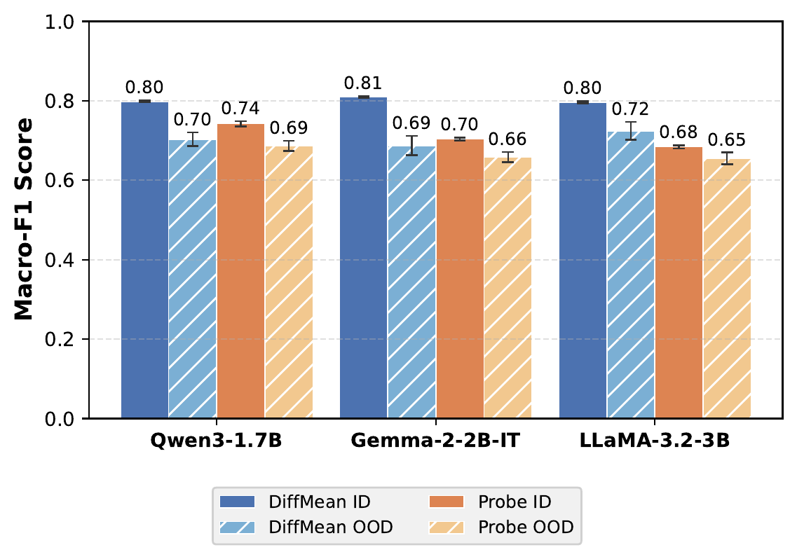
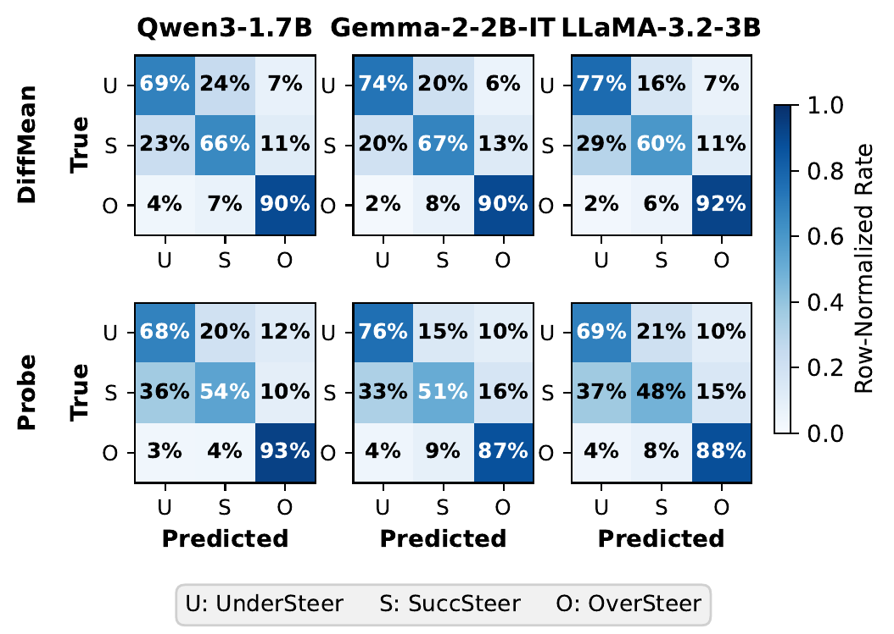
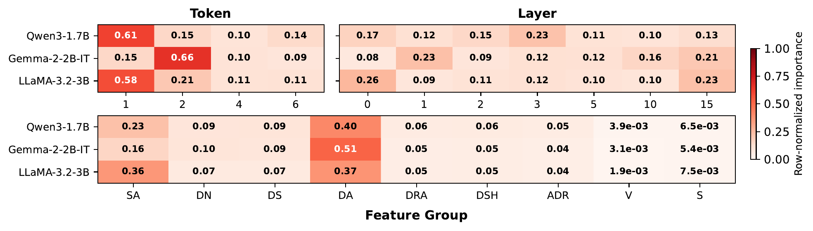
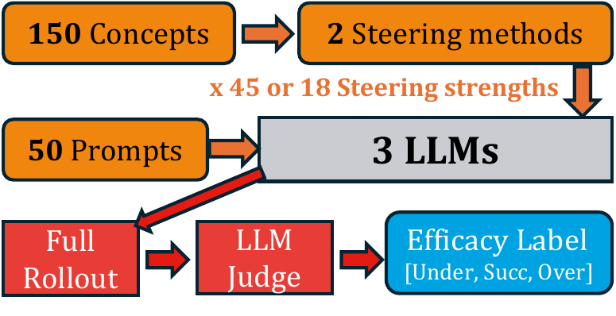

# When is Your LLM Steerable?

### Predicting Activation-Steering Success from the First Few Hidden States

> *Activation steering is brittle: the right strength $\alpha$ is concept-,
> prompt-, and model-dependent, and the standard way to find it is to fully
> decode every candidate and ask an LLM judge — orders of magnitude more
> expensive than the steered generation itself. We show that the **hidden
> states of the first few generated tokens already tell you whether a steer
> will under-shoot, succeed, or over-shoot**, and a tiny GBDT reads that
> signal off at ~0.80 macro-F1 on seen concepts and ~0.70 on **unseen** ones.
> Plug it in as an $\alpha$-ranker and you recover **~98% of the
> exhaustive-grid-search success rate at ~11% of its decoding cost.***

<!-- <p align="center">
  
</p>

This repository accompanies the NeurIPS 2026 preprint
**“When is Your LLM Steerable?”** It releases:

- **ASTEER** — a 1.42 M-row testbed of labelled steered generations
  (150 concepts × 50 AlpacaEval prompts × {DiffMean, LinearProbe} × 18 / 45
  strengths × {Qwen3-1.7B, gemma-2-2b-it, Llama-3.2-3B-Instruct}),
  with Cohen’s $\kappa = 0.83$ between the LLM judge and human annotators.
- **SteerBoost** — a lightweight GBDT predictor that takes the first $K$
  steered hidden states and outputs $P(\texttt{Under} / \texttt{Succ} /
  \texttt{Over})$ without a full rollout.
- The full reproducibility stack: rollout, hidden-state extraction, judging,
  feature caching, training, and the **AlphaSearch** evaluation that uses
  the predictor to pick which $\alpha$ to actually decode. -->

**Dataset:** [`Fcr09/SteerBoost-data` on Hugging Face](https://huggingface.co/datasets/Fcr09/SteerBoost-data)

---

## Why steering is harder than it looks

<p align="center">
  
</p>

Across the three open models we test, the **overall steering success rate is
only 10–23%** — even when you sweep $\alpha$ on a fine grid:

| Model                | DiffMean | LinearProbe |
|----------------------|:--------:|:-----------:|
| Qwen3-1.7B           |  18.7%   |    10.7%    |
| gemma-2-2b-it        |  22.2%   |    23.2%    |
| Llama-3.2-3B-Instruct|  16.1%   |    18.4%    |

Picking the right $\alpha$ matters enormously: too small and the steer is
invisible, too large and the model derails. As the figure above shows,
the effective window is *concept-specific, prompt-specific, and
model-specific* — same model, same method, different concept (`c=0` vs
`c=43` vs `c=88`) or prompt (`p=0` vs `p=8` vs `p=41`) and the success
window shifts, narrows, or disappears entirely. The Probe method on
Llama-3.2-3B even lives on an $\alpha$ scale ~20× smaller than on the
other two models. The only known way to find the right $\alpha$ today is
a full grid search with an expensive LLM judge.

**This codebase asks a simpler question:** do we really need to finish the
rollout to know it was doomed? It turns out we don’t.

---

## SteerBoost

<p align="center">
  
</p>

For every $(\text{concept}, \text{prompt}, \alpha)$ triple we run two
forward passes — a $K$-step steered decode, and a no-steer replay over
the same $(\text{prompt}, y_{1..K})$ tokens — and compare the matched
hidden states. From the pair we extract three feature families:

- **Steering Geometry** — alignment with $v_c$, deviation norm, directional
  similarity, deviation-alignment (cosines at each (token, layer)).
- **Decoding Dynamics** — how those geometric quantities evolve across the
  first $K$ tokens.
- **Steering Condition** — $\|v_c\|$ and $\alpha$.

A class-balanced **XGBoost** then maps these into
$\{\texttt{UnderSteer}, \texttt{SuccSteer}, \texttt{OverSteer}\}$ — the same
label an LLM judge would produce after fully decoding the response.

---

## Results

### 1. Steering outcomes really are predictable from the first few tokens

<table align="center">
  <tr>
    <td width="44%" valign="middle" align="center">
      
      <br/><sub><b>Macro-F1 on ID vs held-out (OOD) concepts.</b></sub>
    </td>
    <td width="56%" valign="middle" align="center">
      
      <br/><sub><b>Row-normalized confusion matrices.</b></sub>
    </td>
  </tr>
</table>

A single GBDT generalises across three models and two steering methods.
On **DiffMean** it reaches ~0.80 macro-F1 in-distribution and retains
~0.70 on 30 fully held-out concepts — strong evidence that the predictive
signal is a property of the steering operation itself, not a concept
fingerprint. `OverSteer` in particular is recognised with **87–93%
recall** across every (model, method) cell — exactly the regime where a
deployed system most needs an early stop. The dominant residual confusion
is at the soft `Under` ↔ `Succ` boundary, as you’d expect from a graded
phenomenon.

### 2. The signal lives where theory says it should

<p align="center">
  
</p>

Gain-based importance concentrates on (a) the **first 1–2 generated
tokens** (>75% of the mass), (b) a broad spread of layers — not just the
intervention layer — and (c) the two alignment feature groups,
`SA` (steered hidden ↔ $v_c$) and `DA` (induced change ↔ $v_c$). The
intervention’s *direction* matters more than its magnitude — consistent
with steering acting as a directional bias on the residual stream.

### 3. Plug it in as an $\alpha$-ranker → near-oracle success at a fraction of the cost

Treat $P(\texttt{Succ})$ as a ranker over the $\alpha$ grid, decode only
the top-$K$ candidates, and stop on the first success. At $K=20$,
**SteerBoost-guided search recovers ~98% of the item-level oracle’s
success rate using only ~11% of the decoded tokens** of full grid search,
beats every non-oracle baseline (CGS, TCGS, IGS-A, IGS-D) at every
budget, and the trend holds on both ID and OOD concepts. Reproduce with
`bash scripts/06_run_alphasearch.sh`.

---

## Quickstart

```bash
conda create -n steerboost python=3.12 -y
conda activate steerboost
pip install -r requirements.txt
export OPENAI_API_KEY="sk-..."       # only needed for label / example generation

# Skip the >500 GB hidden-state regeneration: pull caches for the 3 paper models.
python scripts/download_data.py      # ~9 GB → ./data/

# Train the early predictor and reproduce the figures above:
bash scripts/05_train_xgb.sh         # saves model + confusion + feature-importance
bash scripts/06_run_alphasearch.sh   # cost-vs-success-rate vs every baseline
```

A single GPU is enough for any step that involves the LLM; the XGB trainer
and AlphaSearch run on CPU.

---

## The ASTEER dataset

<p align="center">
  
</p>

- **150 concepts** stratified into three abstraction levels: low (surface
  format, e.g. emojis, uppercase, bold), mid (discourse, e.g. asks a
  clarifying question, contains a warning), high (persona, topic,
  framing).
- **50 prompts** sampled from AlpacaEval, held fixed across all concepts.
- **3 LLMs** × **2 steering methods** (DiffMean & LinearProbe) × **45 or 18
  strengths**, judged by GPT-5-nano with the three-way rubric in
  `submit_gpt_judgment.py`.
- **Quality:** Cohen’s $\kappa = 0.74$ vs GPT-5.5 and **0.83 vs human
  annotators** on 600 cross-checked samples.

Steered generations, GPT labels, and pre-built feature caches ship on
[`Fcr09/SteerBoost-data`](https://huggingface.co/datasets/Fcr09/SteerBoost-data).
Raw hidden-state tensors (>500 GB) are reproducible locally with one
shell script.

---

## Full pipeline

All scripts read configuration from environment variables — defaults match
the **Qwen3-1.7B / DiffMean / Layer-10** row reported in the paper.
Override as needed:

```bash
export METHOD=diffmean              # or probe
export MODEL=Qwen/Qwen3-1.7B        # any HF causal-LM
export MODEL_SHORT=Qwen3-1.7B       # last path component used in folder names
export LLM=Qwen3-1.7B               # short name for downstream scripts
export LAYER=10
export ALPHA_START=0.2 ALPHA_STOP=9.0 ALPHA_STEP=0.2
export K_LIST="1,2,3,5,10,15"
export N_LIST="1,3,5"
export NUM_SAMPLES=50               # AlpacaEval prompts per concept
export PARTITION=stratified_shuffle # stratified ID/OOD over abstraction levels
```

### 1. Steered rollouts + steered hidden states (GPU)

```bash
bash scripts/01_run_steering.sh
```

Iterates over `data/concepts.json` and the α grid. For each concept it
(a) ensures `data/training/{cid}.json` exists, calling GPT to generate the
positive/negative example bank if not, (b) computes the steering vector
(DiffMean of the two banks, or LinearProbe weights), and (c) generates
steered responses on `--num_samples` AlpacaEval prompts while a forward
hook captures hidden states at layer L and L+k for the requested
`target_token_n_list` positions.

### 2. Paired *raw* hidden states (GPU)

```bash
bash scripts/02_extract_raw_hidden_states.sh
```

Replays the **unsteered** model on the same `(prompt, generated response)`
text pairs and captures hidden states at the matching positions / layers,
giving us aligned `(raw, steered)` pairs that the predictor's features are
defined on. Technically optional — `utils.load_paired_data` will
lazy-generate any missing raw files — but doing it once up front avoids
spinning up the model repeatedly inside training scripts.

### 3. GPT judgment of every (concept, prompt, α) triple

```bash
bash scripts/03_judge_with_gpt.sh
# wait for OpenAI batches to finish, then:
python process_judgment_results.py --last_k <num_batches> --watch
```

The judge gives each response a label in `{0: under-steer, 1: successful
steer, 2: over-steer}` according to the rubric in `submit_gpt_judgment.py`.
Labels are written back into the corresponding
`data/result/{method}/{model}/{cid}/{layer}-{alpha}.json`.

### 4. Build judgment + feature caches

```bash
bash scripts/04_build_caches.sh
```

* `data/cache/judgments__*.json` — every (cid, α, sample) → label, plus
  the average response length used by AlphaSearch's token-cost accounting.
* `data/cache/features__*.npz` — the full ID+OOD feature matrix
  (≈4–6k features per row in the default config), with a sidecar
  `_meta.json` describing the build configuration. Re-running the trainer
  or AlphaSearch with the same configuration is now ~50× faster.

### 5. Train the XGBoost early predictor

```bash
bash scripts/05_train_xgb.sh
```

* 120 ID concepts vs 30 OOD concepts (`stratified_shuffle`), 70/10/20
  prompt-level train/val/test split per concept (seeded).
* Class-balanced sample weights, `n_trials` random hyperparameter samples;
  the validation-best model is saved to
  `saved_predictors_xgb/{llm}/{method}/model.json` together with
  `splits.json` (for AlphaSearch), `result.json` (metrics + class-wise
  confusion matrices), `feature_importance.json`, and a `top_features.png`
  heatmap.

### 6. AlphaSearch

```bash
bash scripts/06_run_alphasearch.sh
```

Reports, on both the held-out ID test prompts and the OOD concepts, the
budget-vs-success-rate trade-off for every α-selection strategy and
writes `pareto.pdf` (baselines + Ours at each *K*) and `pareto_front.pdf`
(non-dominated frontier of Ours over (*K*, threshold)) to
`alphasearch_out/{llm}/{method}/`.

To regenerate the figures from a previously saved `results.json` without
recomputing anything:

```bash
python alphasearch.py --from-results alphasearch_out/Qwen3-1.7B/diffmean/results.json
```

<!-- --- -->

<!-- ## Reproducing the Main Results

Default flags in every shell script reproduce the **Qwen3-1.7B + DiffMean
+ Layer 10** row of the main results table. To produce the LinearProbe
row, set `METHOD=probe`. To produce the gemma-2-2b-it / Llama-3.2-3B-
Instruct rows, set:

```bash
# gemma
export MODEL=google/gemma-2-2b-it MODEL_SHORT=gemma-2-2b-it LLM=gemma-2-2b-it
# llama
export MODEL=meta-llama/Llama-3.2-3B-Instruct MODEL_SHORT=Llama-3.2-3B-Instruct LLM=Llama-3.2-3B-Instruct
```

The *layer* used for steering is model-specific. For the models in the
paper we used:

| Model                              | Layer (L) |
|------------------------------------|-----------|
| google/gemma-2-2b-it               | 10        |
| Qwen/Qwen3-1.7B                    | 10        |
| meta-llama/Llama-3.2-3B-Instruct   | 10        |

`K_LIST` (offsets `L+k` to capture) and `N_LIST` (generated-token positions)
are model-agnostic in our experiments and default to the values listed at
the top of this file.

--- -->

## Repository layout

```
SteerBoost/
├── README.md                       — this file
├── requirements.txt
├── seed_instructions.json          — used when GPT generates training examples
├── data/
│   ├── concepts.json               — 150 target concepts (id 0..149)
│   └── alpaca_eval.json            — 805 AlpacaEval prompts (input distribution)
│
├── steering.py                     — DiffMean / LinearProbe + steered generation
├── pipeline.py                     — concept-level wrapper around a SteeringMethod
├── utils.py                        — I/O helpers, judgment loading, paired-data loader
├── dataset_steering.py             — entry point: steered rollouts + hidden states
├── raw_hidden_state.py             — entry point: paired *unsteered* hidden states
├── submit_gpt_judgment.py          — entry point: queue OpenAI batch judgments
├── process_judgment_results.py     — entry point: poll & write judgments back
├── alphasearch.py                  — entry point: α-selection comparison + plots
│
├── xgb/
│   ├── utils.py                    — handcrafted-feature extractor
│   ├── concept_partition.py        — stratified ID/OOD split over the 150 concepts
│   ├── feature_cache.py            — .npz feature-matrix loader/saver
│   ├── train.py                    — feature/label helpers shared by the trainer
│   ├── train_weighted_search.py    — entry point: weighted XGB hyperparameter search
│   ├── cache_judgments.py          — entry point: collapse result JSONs into one cache
│   └── build_feature_cache.py      — entry point: collapse hidden-state .pt files into .npz
│
├── figures/                        — paper figures (PDF originals + PNG renderings)
└── scripts/
    ├── 01_run_steering.sh          — sweep αs: steered rollouts + hidden states
    ├── 02_extract_raw_hidden_states.sh
    ├── 03_judge_with_gpt.sh        — submit GPT judgments (then poll)
    ├── 04_build_caches.sh          — judgments + features
    ├── 05_train_xgb.sh             — train the early predictor
    └── 06_run_alphasearch.sh       — produce the AlphaSearch tables / Pareto figures
```

<!-- After a full run the directory will also contain:

```
data/training/{concept_id}.json                                              cached GPT-generated pos/neg examples
data/result/{method}/{model}/{cid}/{layer}-{alpha}.json
data/hidden_states/{method}/{model}/{cid}/{layer}-{alpha}.pt                 steered HS
data/hidden_states_raw/{method}/{model}/{cid}/{layer}-{alpha}.pt             raw HS
data/cache/judgments__{method}__{model}__L{layer}.json
data/cache/features__{method}__{model}__L{layer}.npz  (+ _meta.json)
saved_predictors_xgb/{model}/{method}/(model.json|splits.json|...)
alphasearch_out/{model}/{method}/(results.json|pareto.pdf|pareto_front.pdf)
``` -->

---

## Concept list

`data/concepts.json` contains the 150 concepts referenced as concept_id
0..149 throughout the paper. Concepts are stratified into three abstraction
levels by `xgb/concept_partition.py`:

| Level | Concept IDs                            |
|-------|----------------------------------------|
| low   | 0–39 + 120–129                         |
| mid   | 40–79 + 130–139                        |
| high  | 80–119 + 140–149                       |

The default `stratified_shuffle` partition draws 40 ID + 10 OOD concepts
**per level** (seeded), giving 120 ID / 30 OOD overall while preserving the
abstraction-level mix in both halves. The legacy contiguous split (ID
0–119, OOD 120–149) is available as `--id_ood_partition static_ranges`.

---

<!-- ## Citation

If SteerBoost or the ASTEER dataset is useful in your work, please cite:

```bibtex
@inproceedings{fan2026steerable,
  title     = {When is Your {LLM} Steerable? Predicting Activation-Steering Success from Early Hidden States},
  author    = {Fan, Chenrui and Cheng, Yize and Li, Ming and Feizi, Soheil and Zhou, Tianyi},
  booktitle = {Advances in Neural Information Processing Systems (NeurIPS)},
  year      = {2026}
}
``` -->
